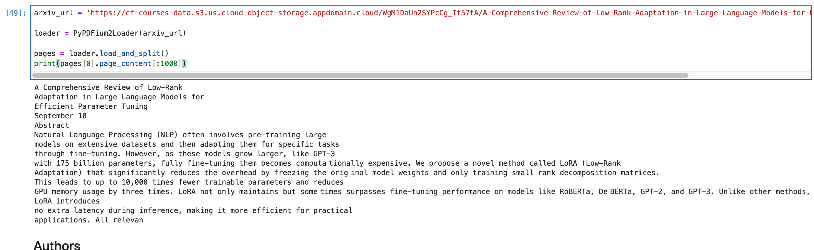
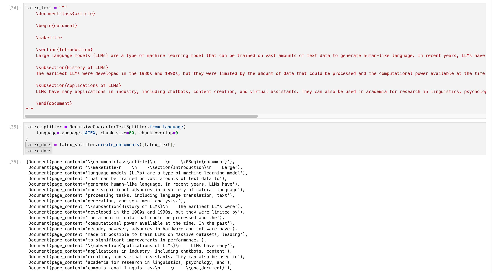
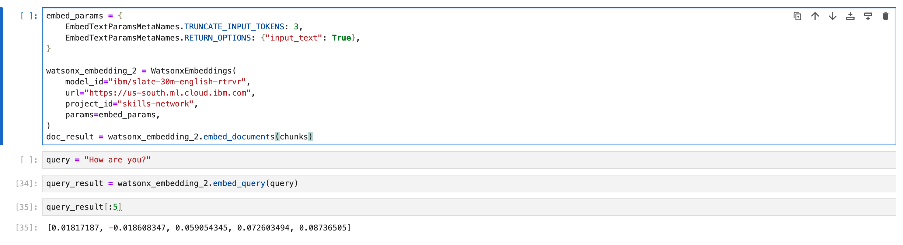
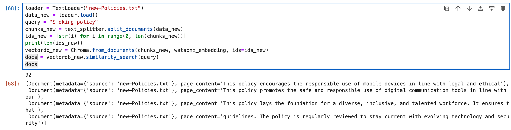
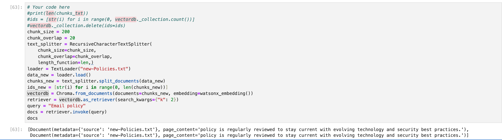
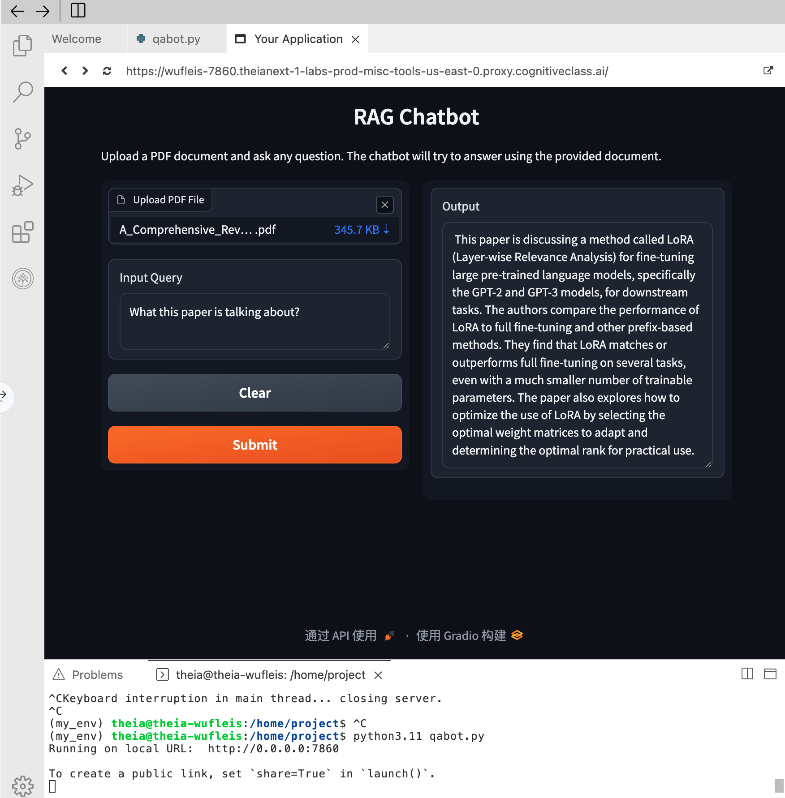

# Qa-bot-Webapp-ibm-capstone
QA Bot Web App using LangChain, IBM Watsonx, and Gradio for document-based Q&amp;A.

# QA Bot Web App 🤖📄

This repository contains my **AI Capstone Project** from IBM’s Coursera **AI Engineering Professional Certificate**.  
The project demonstrates how to build a **Question-Answering (QA) Bot** that uses **LangChain** and a **Large Language Model (LLM)** to answer questions from uploaded PDF documents.

---

## 📌 Project Overview
The objective of this project is to simulate a real-world scenario where AI is applied to **document-based question answering**.  
The bot can load a PDF, split it into chunks, generate embeddings, store them in a vector database, and then use **Retrieval-Augmented Generation (RAG)** to provide context-aware answers.

This project integrates several components:  
- Document loading with **LangChain**  
- Text splitting using **RecursiveCharacterTextSplitter**  
- Embedding generation with **WatsonxEmbeddings**  
- Storing embeddings in **Chroma vector database**  
- Building retrievers for similarity search  
- Interactive Q&A via **Gradio web interface**  

---

## ✨ Features
- 📄 Upload any **PDF document**  
- 🔍 Split and embed content for efficient semantic search  
- 🧠 Generate embeddings with **Watsonx**  
- 🗄 Store embeddings in a **Chroma vector store**  
- 🔎 Retrieve relevant context using similarity search  
- 💬 Ask questions through a **Gradio web interface**  

---

## 🛠️ Tools & Technologies
- **IBM Watsonx**  
- **LangChain** (`PyPDFLoader`, `RecursiveCharacterTextSplitter`, `RetrievalQA`)  
- **WatsonxEmbeddings** (`langchain_ibm`)  
- **Chroma Vector Store**  
- **Gradio**  

---

## 📸 Screenshots
| Component | Screenshot |
|-----------|------------|
| PDF Loader |  |
| Text Splitter |  |
| Embeddings |  |
| Vector DB |  |
| Retriever |  |
| QA Bot UI |  |

---

## ▶️ Usage
This project was developed and tested in the **IBM learning environment** as part of Coursera.  
To replicate the workflow:  
1. Load a PDF document using the Gradio interface.  
2. Enter a query such as:  

What is this paper talking about?

3. The bot retrieves relevant content and generates a response.  

---

## 📜 License
This project was created as part of the **IBM AI Engineering Capstone** on Coursera.  
It is shared here for educational and portfolio purposes.  

---

## 🙌 Acknowledgments
- **IBM & Coursera** for the guided project  
- **LangChain** and **Gradio** open-source communities  

---

